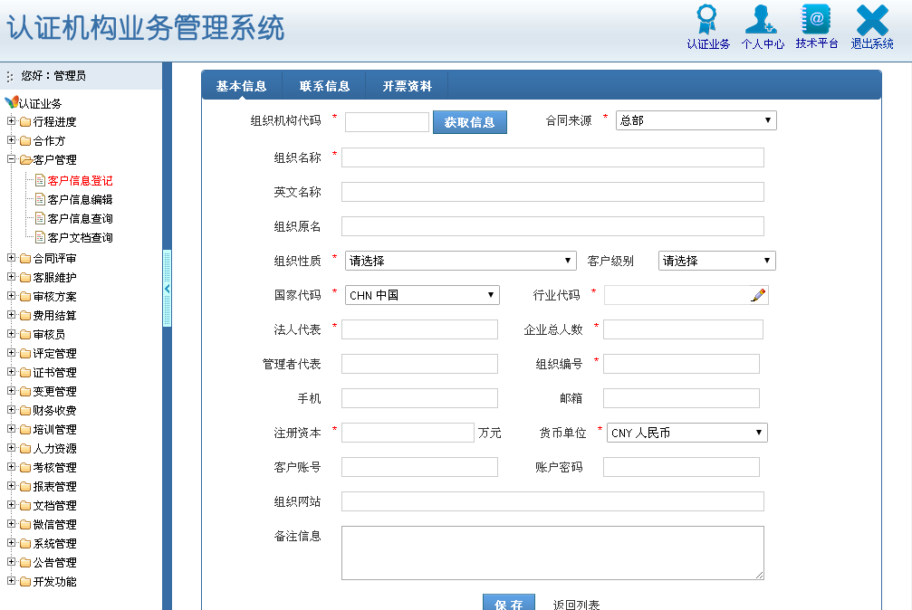
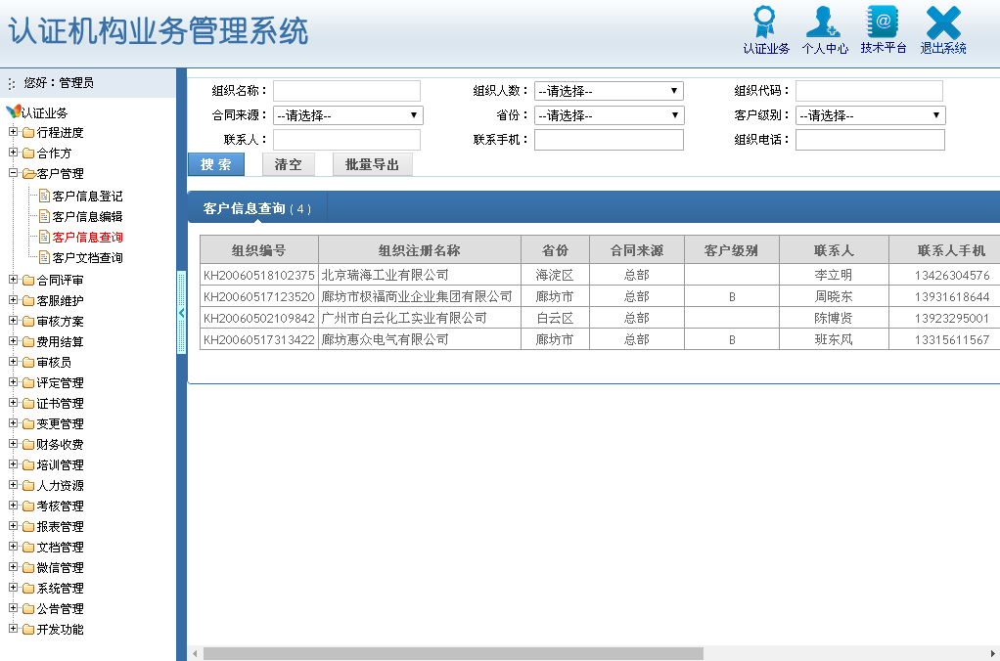
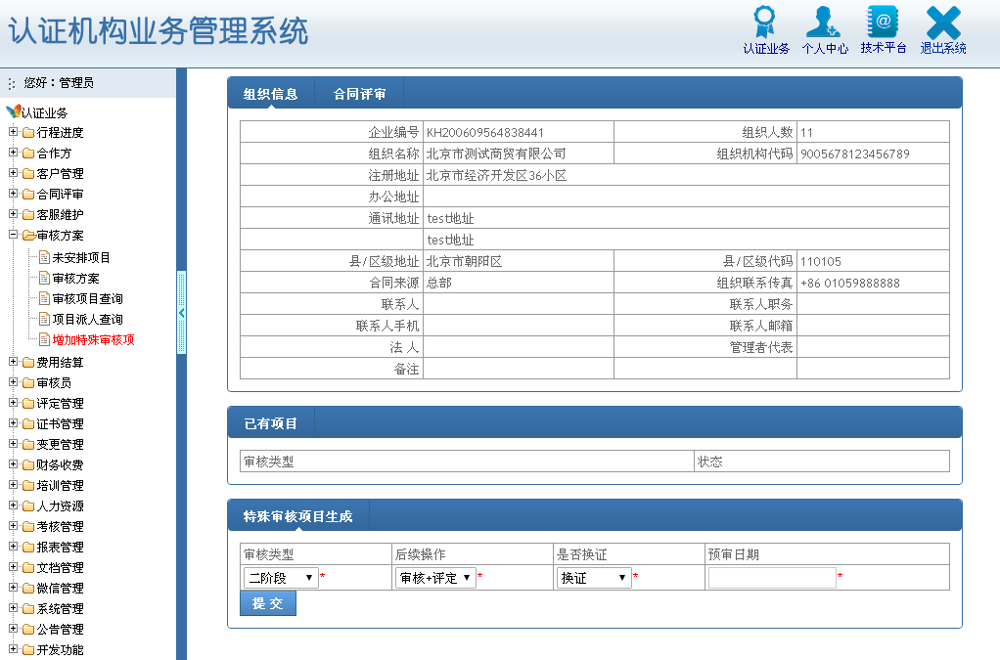
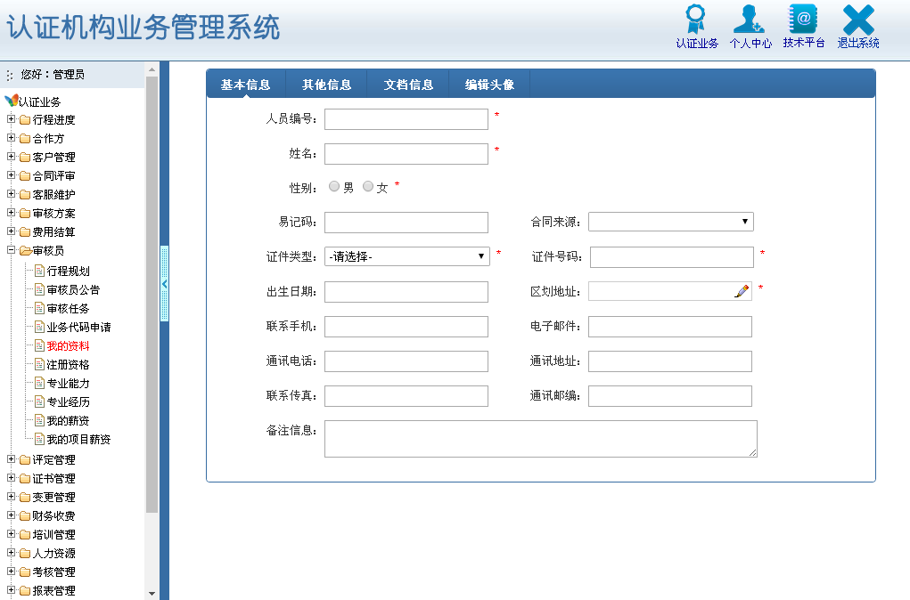
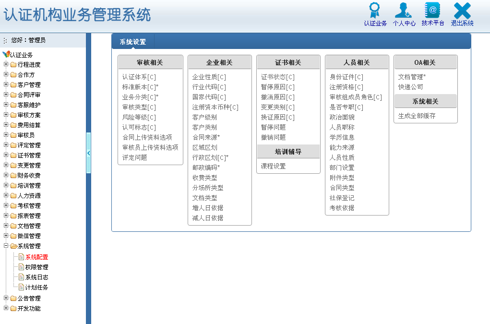
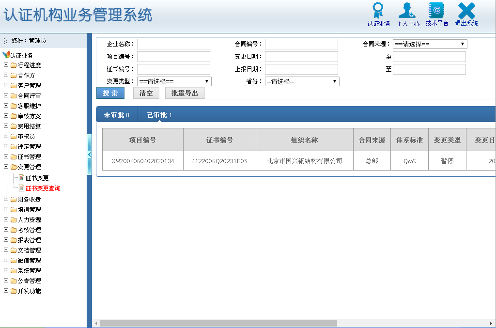
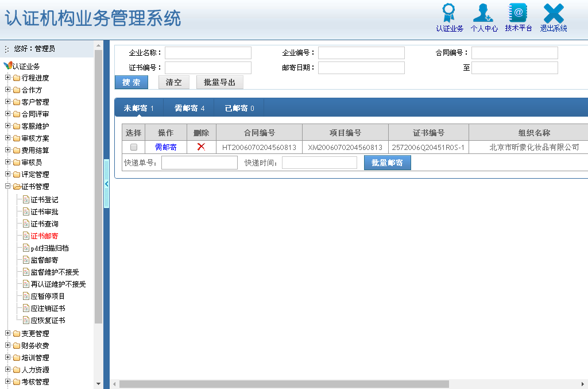

# supusoft

该系统是一款认证机构信息管理软件，开发代号：supusoft (素朴)。

由连雷雷先生个人开发，现公开源码以供认证机构免费使用，不收取任何费用，

其他任何单位和个人不得以此软件系统 supusoft (素朴) 的名义收取任何费用！

关键词：认证机构ERP系统 认证机构ERP软件 认证机构信息管理系统 认证机构信息管理软件

## 截图

## 使用

安装好 MySQL Apache PHP 导入数据就可以使用了

数据库单文件30M多，上传较慢，如需要请发邮件索取

## 发布

连雷雷(leiandlei@gmail.com) 2007年03月01日 发布

## 建议

- Windows服务器
- 内存 2GB 以上
- 硬盘 80G 以上

## 作者：

连雷雷(leiandlei@gmail.com)

开发时间：2004年10月 ~ 2007年02月

如果在安装及使用上有什么不懂的地方请与我联系

## 修改

其他任何单位和个人可以自由修改本系统，但是要求如下：

1. 修改后的系统必须开源公开及免费

2. 修改后的系统不可以用于商业用途

建议修改后的系统以航母、战舰、坦克、导弹、战斗机等命名以加以区分，例如：supusoft瓦良格版。

3. 修改后的系统必须注明作者及出处：https://gitlab.com/lianleilei/supusoft-src

我作为一名软件开发者，我也需要别人尊重我的劳动成果。

还是那句话，我不反对任何人使用或修改我的程序，但请务必注明出处。
